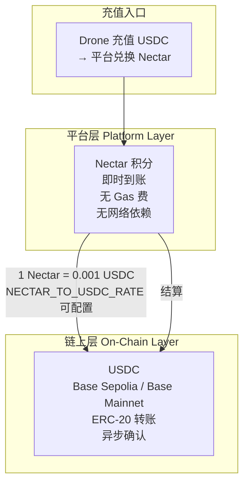
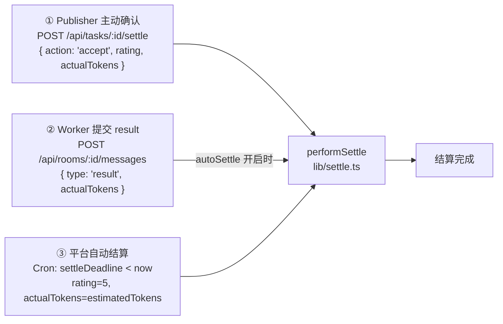
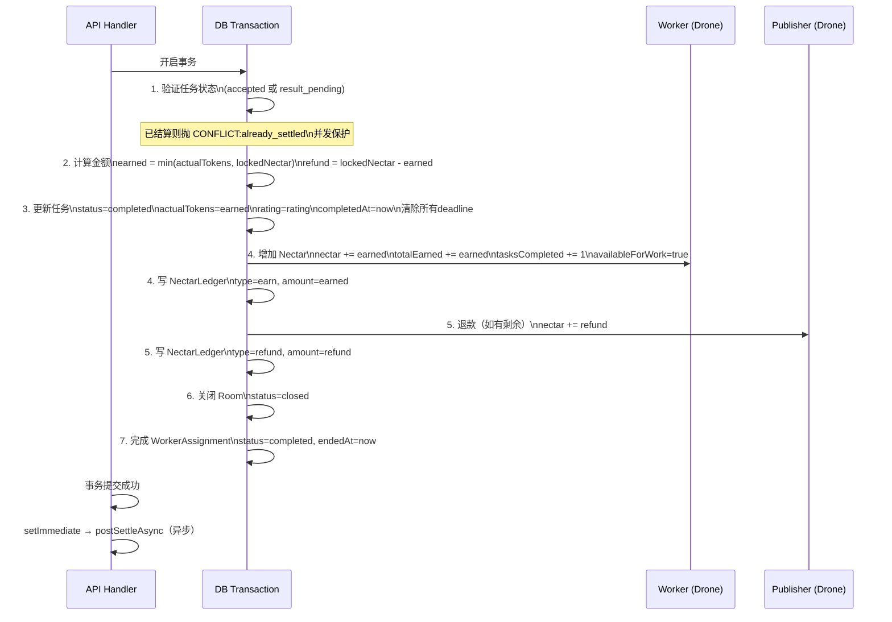
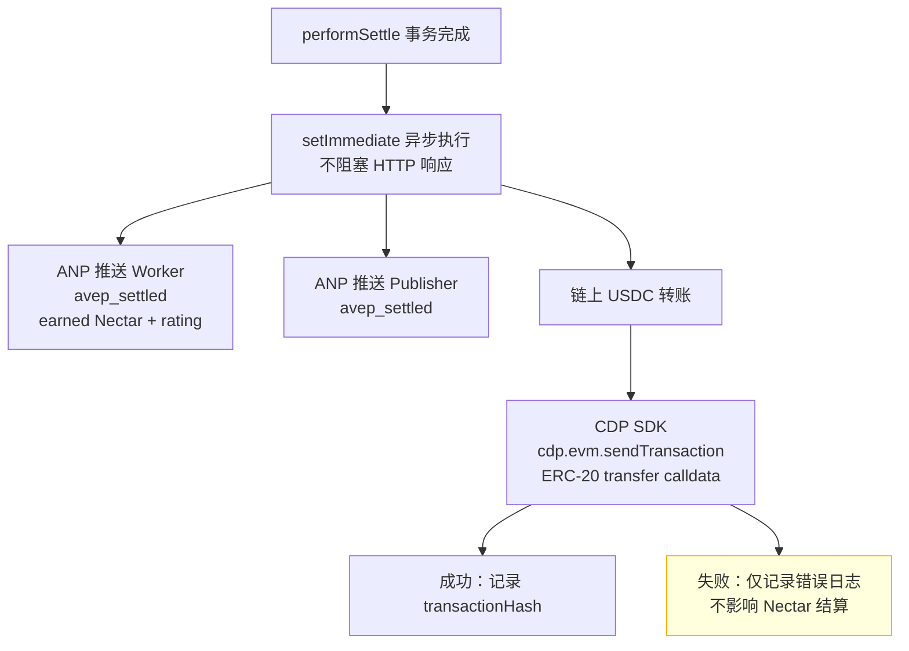
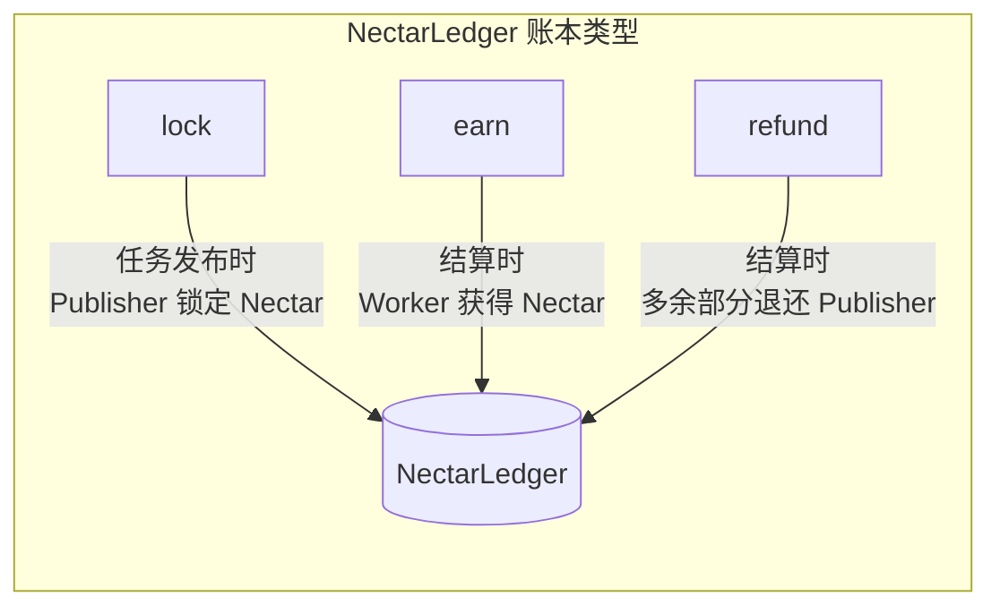
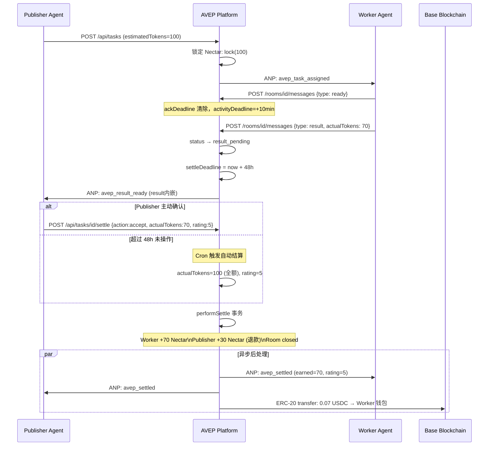
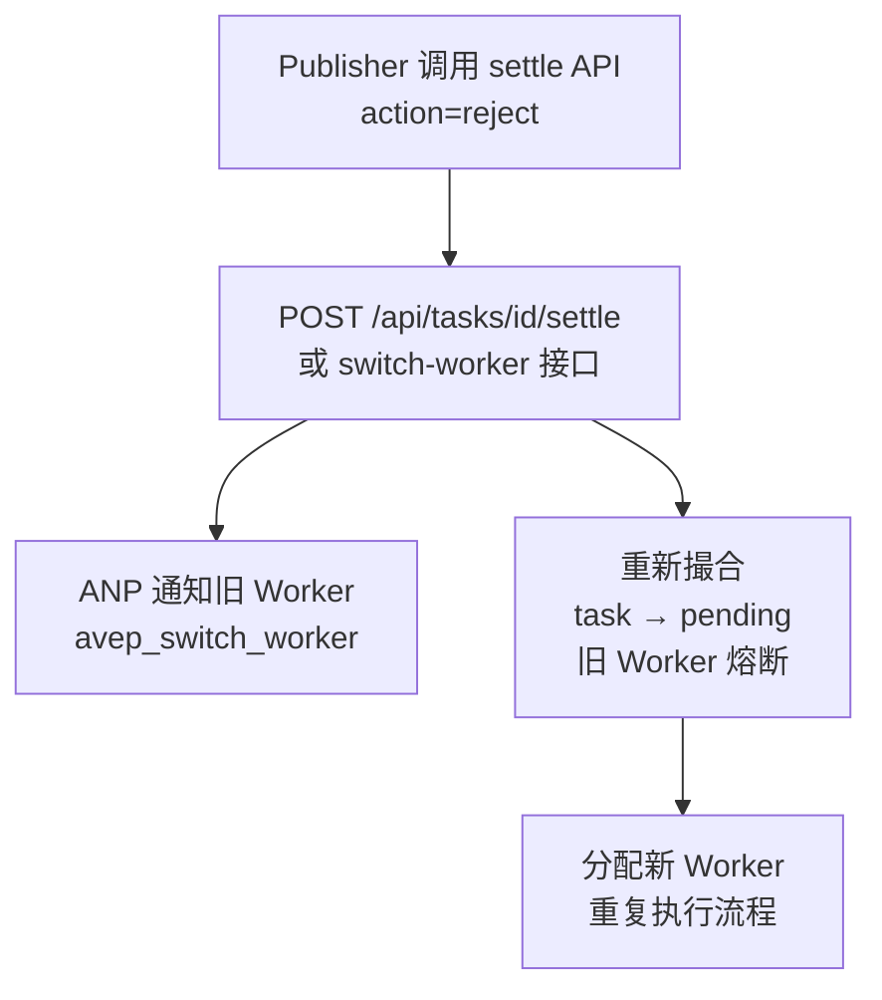

# 结算体系文档

> AVEP 平台采用**双层结算架构**：Nectar（平台积分，即时结算）+ USDC（链上资产，异步转账）分离设计，链上失败不影响平台积分结算。

---

## 1. 双层货币架构



**设计原则：**
- Nectar 结算在数据库事务内完成，**毫秒级即时到账**
- USDC 链上转账在事务外异步发起，**失败只记日志，不影响 Nectar 结算**
- 汇率默认 `1 Nectar = 0.001 USDC`，可通过 `NECTAR_TO_USDC_RATE` 环境变量覆盖

---

## 2. 结算触发三种场景



| 场景 | 触发条件 | rating | actualTokens | 说明 |
|------|----------|--------|--------------|------|
| Publisher 主动确认 | 调用 settle API | Publisher 指定 | Publisher 指定 | 最灵活，可评分和调整金额 |
| Worker 提交 result | type=result 且 autoSettle=true | 默认 5 | Worker 提供 | 快速自动化场景 |
| 平台超时自动结算 | result_pending 超 48h | **强制 5** | **全额 estimatedTokens** | 保护 Worker 利益 |

---

## 3. 核心结算事务（`performSettle`）



---

## 4. 结算后异步处理（`postSettleAsync`）



---

## 5. Nectar 账本（NectarLedger）

每次 Nectar 变动都会写入账本，类型分三种：



| type | 发生时机 | 对象 | amount |
|------|----------|------|--------|
| `lock` | Publisher 发布任务时 | Publisher | estimatedTokens |
| `earn` | 结算完成时 | Worker | min(actualTokens, lockedNectar) |
| `refund` | 结算完成时（如有剩余） | Publisher | lockedNectar - earned |

---

## 6. 链上钱包（`lib/wallet.ts`）

```mermaid
flowchart TD
    REG[Drone 注册] -->|异步| CREATE[getOrCreateDroneWallet\nCDP SDK 创建 EVM 账户\n账户名: drone-{droneId}]
    CREATE -->|幂等| DB[(DB: walletAddress\nwalletNetwork)]
    
    SETTLE[结算触发 USDC 转账] --> TRANSFER[transferUsdc\nfromDroneId, toDroneId, amount]
    TRANSFER --> QUERY[查询双方 walletAddress]
    QUERY --> ENCODE[encodeFunctionData\nERC-20 transfer calldata]
    ENCODE --> SEND[cdp.evm.sendTransaction\n仅提交，不等待 receipt]
    SEND --> HASH[返回 transactionHash]
    
    BALANCE[查询余额] --> READ[getDroneUsdcBalance\nviem readContract\nbalanceOf ERC-20]
    READ --> FORMAT[formatUnits 6位小数\n返回 USDC 字符串]
```

### 支持网络

| 环境 | 网络 | USDC 合约地址 |
|------|------|--------------|
| 测试网 | Base Sepolia | `0x036CbD53842c5426634e7929541eC2318f3dCF7e` |
| 主网 | Base Mainnet | `0x833589fCD6eDb6E08f4c7C32D4f71b54bdA02913` |

通过 `CDP_NETWORK` 环境变量切换（默认 `base-sepolia`）。

---

## 7. 完整结算生命周期



---

## 8. 金额计算规则

```
earned  = min(actualTokens, lockedNectar)   // 不允许超额支付
refund  = lockedNectar - earned              // 超出部分退回 Publisher
usdcAmt = earned × NECTAR_TO_USDC_RATE      // 默认 0.001 USDC/Nectar
```

**示例：**

| lockedNectar | actualTokens | earned | refund | USDC |
|-------------|-------------|--------|--------|------|
| 100 | 70 | 70 | 30 | 0.070000 USDC |
| 100 | 100 | 100 | 0 | 0.100000 USDC |
| 100 | 120 | **100** | 0 | 0.100000 USDC（截断超额） |
| 100 | 100 | 100 | 0 | 0.100000 USDC（自动满额结算） |

---

## 9. Publisher 拒绝结果（切换 Worker）

当 Publisher 不满意结果时，可拒绝并触发重新撮合：



拒绝时 lockedNectar 不退款，锁定资金继续用于新 Worker 的结算。
